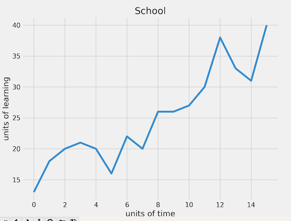

# Simple Parse and Graph

In this homework, you will be creating a single line in a line graph from a
simple dataset.

To complete this homework, you need to complete four basic steps:
1. Copy the `simple_data.txt` file in Schoology onto your computer in a place
   where your python code can read it
2. Create a new file called `simple_graph.py` in your skeleton's `src` folder
3. Read the `simple_data.txt` file into your python program and convert it into
   a list of numbers
4. Graph that single list of numbers

In the end you should end up with a gradually increasing line graph like the one
seen below.

To complete the homework, add the proper title and axes labels to make your graph
look exactly like the one seen below.

